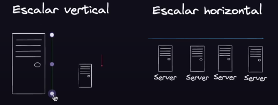

# AWSBnjmn

Aprendiendo AWS: La plataforma más transversal, integral y completa del mundo!

competidores: (Azure, google cloud)

Cloud: Es el ordenador de otra persona, es el servidor que no lo tienes tu, que no está ni en tu empresa ni de un trabajador. Se lo alquilas! Esta computación en la nube se alquila por uso, no necesitamos mantenimiento, lugar, 
latencia, tener sv, solo se alquila, más cómodo. y de esos

sv de datos, redes, almacenamiento, bd, servicios de todo tipo

AWS: una colección de servicios en el cloud
es mejor y más comodo para escalar tanto horizontal como vertical!

¿Porqué aprender AWS?

1. liderazgo y popularidad.
2. Amplia gama de servicios: tiene un monton de servicios
3. Escalabilidad y flexibilidad: cualquier idea que tengas podrás escalarla

¿Qué aprenderemos?

1. Introducción
2. UI de inicio
3. Cómo no QUEMAS DINERO
4. EC2
5. Bases de datos
6. S3 y AWS cli
7. AWS lambda (funcionees sv less)
8. Por dónde continuar

Pre Requisitos!

1. Crear una cuenta
2. Instalar el CLI de AWS ( COMMAND LINE INTERFACE ) (SUDO APT INSTALL awscli)
3. Activar el MFA (Autenticación Multifactor)
4. (OPC) Create a billing alarm to monitor your estimated AWS charges

## Escalamiento 

aveces puedes tener un "spike" al saturar la pagina (Exceso de solicitudes.)

Escalar vertical es aumentar hacia "arriba" el servidor, al igual que la base de datos.

"subirlo hacia arriba", tambien puede ser bajar.

escalar horizontalmente, es tener más maquinas para distribuir la máquina

escalar vertical: 1. downtime
                2. más sencillo
                3. mejor coste
                4. vertical tiene límite

escalar vertical: 1. 0 downtime
2.más complicado
3.más caro
4. disponibilidad, al caerse un servidor.

